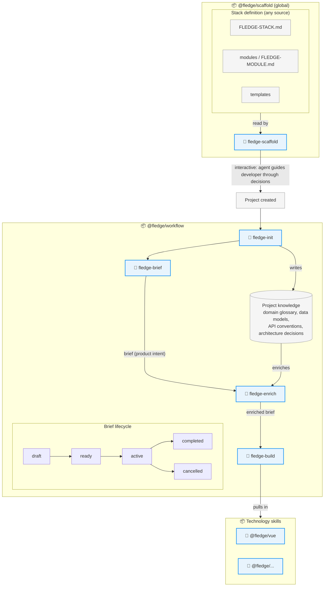

# Roadmap

## Vision

AI-assisted development is only as good as the workflow it operates within. Most teams have great AI tools but no AI-native workflow. Fledge structures the development process so that AI works with team principles, not against them.

The core idea is the **what/how split**:

- **"The what"** -- what to build. Feature-driven briefs that capture intent, requirements, and design decisions. Enriched with project knowledge before building begins.
- **"The how"** -- how to build it. Technology-specific skills that guide agents through decisions using decision trees, conventions, and patterns.

Between the two sits **project knowledge**: a living understanding of the system (data models, domain glossary, API conventions, architecture decisions) that bridges the gap. The workflow layer produces feature briefs enriched by project knowledge. The technology skills consume those briefs and produce code that follows team conventions.

## Strategy

These principles guide what Fledge builds and how:

- **Feature-driven, not domain-driven.** Work is organized around features, not system domains. A feature brief captures one user-facing change end-to-end (frontend, backend, data model). Domain-level understanding lives in project knowledge, not in the workflow artifacts.
- **Skills as infrastructure.** Prompt engineering is team infrastructure, not personal skill. Skills live in the repo, are versioned, and travel with the project.
- **Project knowledge as a living system.** The agent's understanding of the project is not a static config file. It is structured, discoverable, and maintained as the project evolves. Initialization creates it, the workflow consumes it, and completed features feed back into it.
- **Progressive adoption.** Every package delivers standalone value. Technology skills work without the workflow layer. The full workflow emerges naturally as more pieces are adopted.
- **Technology-aware, not technology-agnostic.** Generic tools produce generic results. Fledge ships opinionated, technology-specific skills that guide agents through implementation decisions.
- **Fluid, not linear.** The workflow supports exploration, iteration, and revision. Feature briefs can be refined during building. Rigid phase gates do not reflect how real work happens.
- **Human-in-the-loop, not human-at-the-end.** The agent drives the conversation, but the human makes the decisions. Workflow skills are interactive: they ask questions, propose options, and wait for direction. Because all artifacts are plain files, the human can also edit outside the agent conversation at any time. The agent assists; the human owns the outcome. To keep this efficient, the agent should make obvious decisions autonomously and present remaining choices as specific options rather than open-ended questions.
- **No runtime.** No daemon, no server, no proprietary format. Everything is files the agent reads and conventions the agent follows. The CLI has no dependency on agent capabilities.
- **Design over build time.** Spending more time on design and specification makes building straightforward for agents.

## The workflow

The developer experience, from idea to working code:

```
Init          <- Bridge project knowledge (once, re-run to update)
Brief         <- Capture what to build: requirements, scope, design decisions
Enrich        <- Connect the brief to project knowledge (data models, APIs, domain concepts)
Build         <- Implement the feature vertically, guided by enriched brief and technology skills
```

The workflow is fluid. Steps can be revisited: building may reveal design gaps, which flow back into the brief. The sequence is a default, not a gate.

Four skills own the workflow:

- **fledge-init** ideally runs once per project to discover and structure project knowledge (data models, domain glossary, API conventions, architecture decisions). Can also be re-run to update the project knowledge bridge as the project evolves, interactively with the developer when needed.
- **fledge-brief** captures the product-level intent: requirements, scope, and design decisions. Briefs go through lifecycle stages (draft, ready, active, completed, cancelled).
- **fledge-enrich** connects the brief to project and technical knowledge. Domain concepts, data models, API conventions, and architecture decisions are layered onto the brief so the agent has full context for building.
- **fledge-build** implements the feature vertically (full stack) based on the enriched brief, pulling in technology skills for each layer.

See [docs/workflow.md](docs/workflow.md) for the full lifecycle, state transitions, and skill responsibilities.

Completed briefs accumulate as project knowledge. Each completed brief requires a summary that captures what was built and key decisions made. When creating new briefs, the agent reads these summaries for context.

### Greenfield project lifecycle

For new projects, the full lifecycle spans two packages. For existing projects, the lifecycle starts at fledge-init.



### Supporting systems

Two systems support the workflow:

```
Project knowledge (living, maintained)       Feature briefs (per feature)
├── data models                              ├── recipe-versioning/
├── domain glossary                          │   ├── brief.md
├── API conventions                          │   ├── spec.md
├── architecture decisions                   │   └── tasks.md
└── installed skills + conventions           └── recipe-sharing/
                                                 └── ...
```

## Package architecture

Two types of packages, one clear boundary: the CLI handles mechanical operations (files, directories, scaffolding), skills handle tasks that require understanding and judgment (writing briefs, exploring code, verifying results).

```
packages/
  cli/                  @fledge/cli         CLI binary, devDependency or global
  workflow/             @fledge/workflow     Multiple workflow skills (project-local)
    skills/
      init/             fledge-init         Project knowledge bridge (once, re-run to update)
      brief/            fledge-brief        Feature brief creation and lifecycle
      enrich/           fledge-enrich       Enrich brief with project and technical knowledge
      build/            fledge-build        Vertical feature implementation
  scaffold/             @fledge/scaffold    Scaffolding skill (global install)
    skill/
      SKILL.md          fledge-scaffold     Templates, scripts, interactive conversation
  vue/                  @fledge/vue         Vue technology skill (project-local)
    skill/
      SKILL.md          fledge-vue
```

### CLI vs agent responsibilities

The CLI provides commands that both humans and skills invoke. Skills delegate mechanical work to the CLI, then take over for tasks that need reasoning.

```
developer or skill
        |
        v
  fledge <command>        <- CLI: deterministic, no LLM
        |
        v
  files on disk           <- dirs, stubs, config, knowledge structure
        |
        v
  skill takes over        <- agent: fills in content, makes decisions
```

| Responsibility              | Owner         | Examples                                             |
| --------------------------- | ------------- | ---------------------------------------------------- |
| Schemas and validation      | CLI           | Brief format, knowledge file structure, project config. Defined with zod, used by CLI commands and available to skills |
| File and directory creation | CLI           | Create brief stubs, knowledge dirs, project scaffold |
| Interactive project setup   | CLI           | `fledge init`, `fledge scaffold`                     |
| Skill installation          | CLI           | Copy skill files on postinstall                      |
| Listing and status          | CLI           | List briefs, list knowledge sources                  |
| Understanding code          | Agent (skill) | Explore codebase, discover project knowledge         |
| Writing brief content       | Agent (skill) | Requirements, design decisions, task breakdown       |
| Enriching with context      | Agent (skill) | Connect brief to data models, conventions            |
| Build guidance              | Agent (skill) | Technology skills guide agent through decisions      |
| Verification                | Agent (skill) | Check results against brief and conventions          |

### Global vs project-local

| Package            | Install context | Purpose                                                 |
| ------------------ | --------------- | ------------------------------------------------------- |
| `@fledge/cli`      | Project-local   | CLI binary, all project commands (`init`, `brief`, etc) |
| `@fledge/workflow` | Project-local   | Workflow skills (init, brief, enrich, build)            |
| `@fledge/vue`      | Project-local   | Vue technology skill                                    |
| `@fledge/scaffold` | Global          | Scaffolding skill, runs before a project exists         |

## Current state

The foundation is being established with `@fledge/vue` as the first technology skill. The focus is on proving that skills can reliably produce consistent, high-quality output for a specific technology before expanding scope.

What exists today:

- `@fledge/cli` -- install mechanism for skill packages
- `@fledge/vue` -- Vue skill covering components, composables, data fetching, forms, and styling
- Skill design principles formalized in [docs/skill-design.md](docs/skill-design.md)
- Playground-driven development workflow for iterating on skills
- CI/CD pipeline with changesets for versioning and publishing

## Roadmap

### Phase 1: Foundation

Establish the skill model and prove it works.

- [x] Skill install mechanism (`@fledge/cli`)
- [x] First technology skill (`@fledge/vue`) with decision tree structure
- [x] Playground for iterating on skills
- [x] Skill design principles documented
- [x] CI/CD pipeline with automated releases
- [ ] Validate skill effectiveness through real project usage
- [ ] Refine the three-layer model (principles, patterns, implementation) based on practical experience

### Phase 2: Workflow layer

The feature-driven workflow with four skills: init, brief, enrich, build. See [docs/workflow.md](docs/workflow.md) for the full lifecycle design.

#### fledge-init

Project knowledge bridge. Discovers and structures project knowledge so downstream skills can consume it efficiently. Ideally runs once, but can be re-run to update the knowledge bridge as the project evolves (interactive with user input when needed).

- [x] Init CLI command creates `.fledge/project.md` template
- [x] Init skill explores the codebase and populates project knowledge
- [ ] Discover and register project knowledge sources (data models, domain glossary, API conventions)
- [ ] Connect installed technology skills to project context
- [ ] Establish the project knowledge structure so it can be maintained as the project evolves

#### fledge-brief

Feature brief creation and lifecycle management. Captures product-level intent.

- [x] Define the feature brief format (requirements, design, tasks) with zod schemas
- [x] Brief lifecycle CLI commands (create, ready, start, complete, cancel, status, list, validate, schema)
- [x] Completion requires a summary for use as project context in future briefs
- [x] Brief states: draft, ready, active, completed, cancelled
- [x] Task states: pending, active, completed, skipped
- [x] Brief anatomy: brief.md (product), spec.md (technical context), tasks.md (tasks)
- [ ] Validate brief skill through real project usage

#### fledge-enrich

Enriches a brief with project and technical knowledge. Layers domain concepts, data models, API conventions, and architecture decisions onto the brief so the agent has full context for building.

- [ ] Define what enrichment adds to a brief (domain context, technical constraints, relevant patterns)
- [ ] Build the enrich skill
- [ ] Validate enrichment quality through real project usage

#### fledge-build

Implements features vertically (full stack) based on enriched briefs, pulling in technology skills for each layer.

- [ ] Build the build skill: task planning with technology skills, vertical execution
- [ ] Validate build skill through real project usage

### Phase 3: Project scaffolding (`@fledge/scaffold`)

Agent-based scaffolding for new projects. Filesystem-based stack definitions that can be sourced from anywhere (git repository, local directory, S3, etc.). The agent reads the stack definition and guides the developer through setup interactively.

#### Stack definition anatomy

A stack definition is a directory with a standard structure:

```
my-stack/
  FLEDGE-STACK.md           Stack overview, frontmatter with modules and options
  modules/
    <module-name>/
      FLEDGE-MODULE.md      Agent guidance: how to apply this module, dependencies, options
      templates/            Static file templates for this module
```

- **`FLEDGE-STACK.md`**: frontmatter describes the stack, its modules, and their relationships. Markdown body provides context for the agent when making setup decisions.
- **`FLEDGE-MODULE.md`**: frontmatter describes the module (what it provides, its options, dependencies on other modules). Markdown body guides the agent through applying the module.
- **`templates/`**: static files copied into the project. The agent handles all variants and combinations based on the frontmatter, not through template logic.

The key design principle: **no template engine**. All decisions (which modules to include, how to combine them, what to configure) are made by the agent based on the structured frontmatter and the developer's answers. The agent reads, reasons, and writes. Files in `templates/` are starting points, not interpolated templates.

#### Deliverables

- [ ] Define the stack definition format (FLEDGE-STACK.md and FLEDGE-MODULE.md frontmatter schemas)
- [ ] Scaffolding skill that reads a stack definition and guides the agent through project setup
- [ ] Support multiple sources: local directory, git repository, remote URL
- [ ] Auto-runs fledge-init after scaffolding completes
- [ ] First stack definition based on the playground project as reference

### Phase 4: Quality gates

Testing and review guidance baked into technology skills and the workflow.

- [ ] Testing principles per technology skill (what to test, how to structure tests, deterministic over brittle)
- [ ] Review guidance: separation of generation and review, multi-pass review patterns
- [ ] Context management guidance (when to clear context, how to keep agent reasoning sharp across long tasks)

### Phase 5: Interactive onboarding

A skill that guides new engineers through the project interactively. The agent reads the installed technology skills, project knowledge, and completed feature briefs, then runs a conversation adapted to what the engineer already knows.

- [ ] Onboarding skill with a decision tree for how to run the conversation (what to cover first, how to assess existing knowledge, when to go deeper)
- [ ] Draws from existing skills, project knowledge, and completed briefs at conversation time
- [ ] Adapts depth and examples based on the engineer's background
- [ ] Uses real code from the project for examples rather than abstract illustrations

### Phase 6: Technology expansion

Additional technology skills following the established design principles.

- [ ] Identify the next technology to cover based on project needs
- [ ] Apply the skill design guide to ensure consistency across skills
- [ ] Validate that cross-cutting concerns (testing, error handling) work when expressed per technology

### Open questions

**Naming.** The term "feature brief" is a working name for the workflow artifact. It should signal: scoped to one feature, intent-driven, concise, not a formal system specification. The right term will emerge from real usage.

**Skill inheritance.** Teams can already build their own skills following the [skill design principles](docs/skill-design.md). The three-layer model handles overlap: a team's skill owns its own principles, and project conventions handle project-specific decisions. An open question is whether skills can be extended rather than forked, letting a team skill say "start from `@fledge/vue` but override these specific branches." This would keep team skills lean and automatically pick up upstream improvements. Whether this is reliable in practice (skills are markdown read by an agent, not code with an inheritance model) needs exploration.

**Installing skills from repositories.** The `fledge skills install` command currently works with npm packages. Supporting direct installation from a git repository would make it easier for teams to create and share custom skills without publishing to npm.

**Self-contained skill scripts.** Workflow skills bundle self-contained scripts using rolldown. Each script imports from `@fledge/cli` and is bundled with all dependencies inlined, so skills have zero runtime dependencies. See the [agent skills script spec](https://agentskills.io/skill-creation/using-scripts) for the broader pattern.
