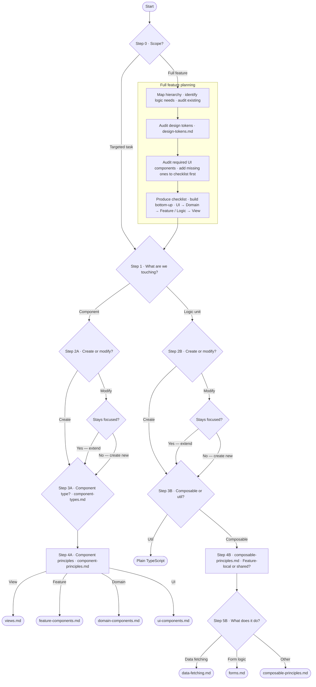

# @fledge/vue

Agent skill package for Vue development.

## Installation

```bash
# pnpm
pnpm add -D @fledge/vue

# npm
npm install --save-dev @fledge/vue

# yarn
yarn add --dev @fledge/vue
```

Skills are copied into the skills directory automatically via `postinstall`. No further setup needed — agents pick them up immediately.

> **pnpm users:** pnpm blocks lifecycle scripts from dependencies by default. After installing, approve the build script by running:
> ```bash
> pnpm approve-builds
> ```
> Alternatively, add the package permanently to your `package.json` so it never needs manual approval again:
> ```json
> {
>   "pnpm": {
>     "onlyBuiltDependencies": ["@fledge/vue"]
>   }
> }
> ```

## Requirements

- Node.js >= 24
- [Claude Code](https://claude.ai/code) or any agent runtime that supports the [Agent Skills](https://agentskills.io/)

## Skills

### vue-core

Guides agents through Vue feature development following conventions. Covers component classification, general principles, type-specific implementation guidance, composables, data fetching, and forms.

#### Component types

A core idea in this skill is that not all Vue components are the same. Each type has distinct responsibilities — mixing them is the most common source of components that are hard to maintain.

| Type                  | Responsibility                                                                          |
|-----------------------|-----------------------------------------------------------------------------------------|
| **View**              | Route-bound entry point for a page. Composes feature and domain components.             |
| **Feature component** | Owns business logic or feature state. Coordinates child components.                     |
| **Domain component**  | Adapts a single UI primitive to a domain concept. No business logic beyond the mapping. |
| **UI component**      | Generic, fully reusable, zero business or domain knowledge. Self-contained styling.     |

#### Decision flow



#### Reference files

- [`component-types.md`](skill/component-types.md) — classification guide, decision questions for each component type, and where styling lives in the hierarchy
- [`component-principles.md`](skill/component-principles.md) — general principles: structure, state ownership, reactivity, v-model, API design, naming, and documentation
- [`ui-components.md`](skill/ui-components.md) — component categories, styling encapsulation, CVA variants, reka-ui primitives, modelValue patterns, accessibility, and icons
- [`design-tokens.md`](skill/design-tokens.md) — how to explore a project's token vocabulary (Tailwind config, CSS custom properties, shared constants) before applying any styling
- [`reka-ui.md`](skill/reka-ui.md) — how to explore reka-ui primitive type definitions before use; group roots, value shapes, and standalone vs. group context
- [`domain-components.md`](skill/domain-components.md) — domain-to-UI mapping, modelValue as domain value, state ownership, and naming
- [`feature-components.md`](skill/feature-components.md) — state ownership, child coordination, composable extraction, and data fetching
- [`views.md`](skill/views.md) — page-level composition and route-level concerns
- [`composable-principles.md`](skill/composable-principles.md) — naming, return shape, and patterns
- [`data-fetching.md`](skill/data-fetching.md) — TanStack Query patterns
- [`forms.md`](skill/forms.md) — TanStack Form + Zod patterns
